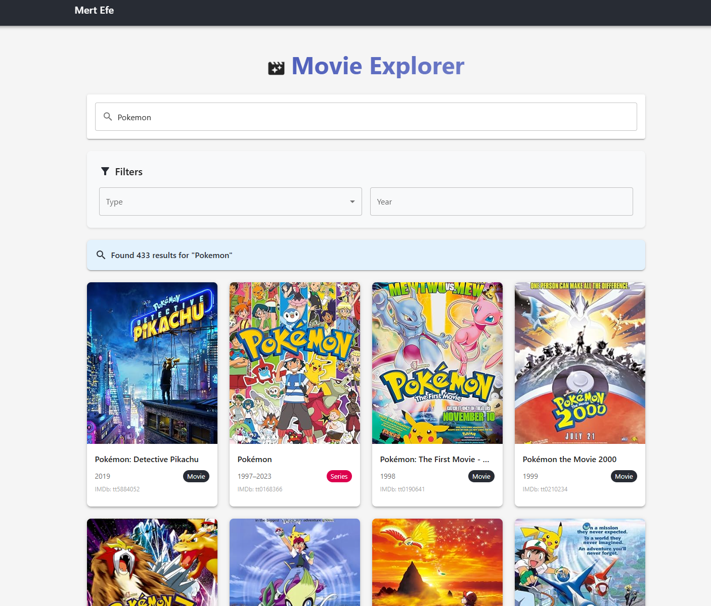

# Movie Explorer

## Link: https://movie-explo.netlify.app/

A single-page application built with React, TypeScript, and Redux Observables that allows users to browse and search for movies, TV shows, and episodes using the OMDb API.



## Features

- Search for movies, TV shows, and episodes by title
- Filter results by media type (movie, series, or episode)
- Filter by release year
- Pagination for browsing through results
- Detailed view for individual movies/shows including:
  - Title, year, runtime, rating
  - Plot summary
  - Cast and crew information
  - IMDb ratings
  - Additional metadata
- Unit Tests: Comprehensive test suite for components, reducers, and utilities

## Technology Stack

- **React**: UI library
- **TypeScript**: Type safety and better developer experience
- **Redux & Redux Observables (RxJS)**: State management with reactive programming
- **React Router**: Navigation and routing
- **SCSS Modules**: Component-scoped styling
- **Material UI**: UI components and styling system
- **Axios**: API requests
- **Lodash**: Utility functions
- **Test**: Jest & Testing Library: Unit and integration testing

## Getting Started

### Prerequisites

- Node.js (v14.0.0 or higher)
- npm (v6.0.0 or higher)
- OMDb API Key (you can use: `ce1ffa69`)

### Installation

1. Clone the repository:

```bash
git clone https://github.com/yourusername/movie-explorer.git
cd movie-explorer
```

2. Install dependencies:

```bash
npm install
```

3. Create a `.env` file in the root directory and add your OMDb API key:

```
REACT_APP_OMDB_API_KEY=ce1ffa69
```

### Running the Application

4. Start the development server:

```bash
npm start
```

The application will be available at http://localhost:3000.

### Available Scripts

- `npm start` - Runs the app in development mode
- `npm test` - Launches the test runner
- `npm run build` - Builds the app for production to the `build` folder

### Building for Production

To create a production build:

```bash
npm run build
```

The build artifacts will be stored in the `build/` directory.

To serve the production build locally, you can use:

```bash
npx serve -s build
```

## Folder Structure

```
movie-explorer/
├── public/             # Static files
├── src/
│   ├── api/            # API integration
│   ├── assets/         # Images and other assets
│   ├── components/     # Reusable components
│   ├── hooks/          # Custom React hooks
│   ├── pages/          # Page components
│   ├── redux/          # Redux state management
│   ├── styles/         # Global styles and SCSS variables
│   ├── utils/          # Utility functions
│   ├── __tests__/      # Unit and integration tests
│   ├── App.tsx         # Main application component
│   ├── index.tsx       # Entry point
│   └── routes.tsx      # Application routes
├── .env                # Environment variables
├── jest.config.js      # Jest configuration
├── package.json        # Dependencies and scripts
└── README.md           # Project documentation
```

## Available Scripts

- `npm start`: Runs the app in development mode
- `npm test`: Runs tests
- `npm run build`: Builds the app for production
- `npm run eject`: Ejects from Create React App configuration

## Future Improvements

- Add caching for API responses
- Implement watchlist functionality with local storage
- Add theme switching (dark/light mode)
